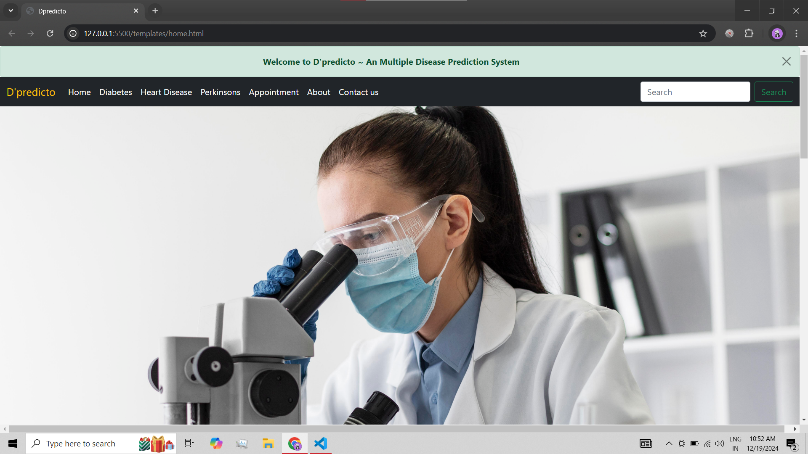
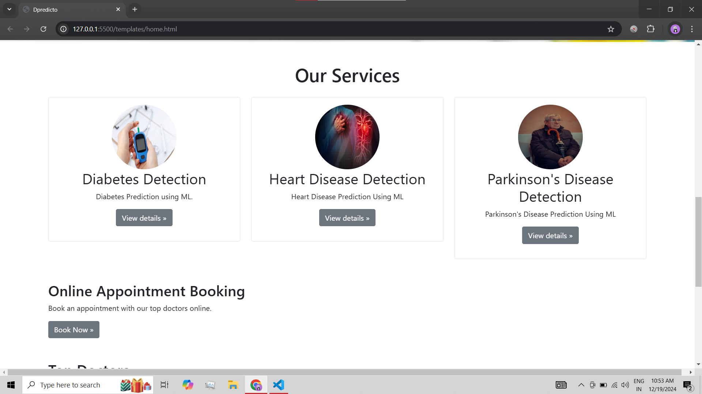
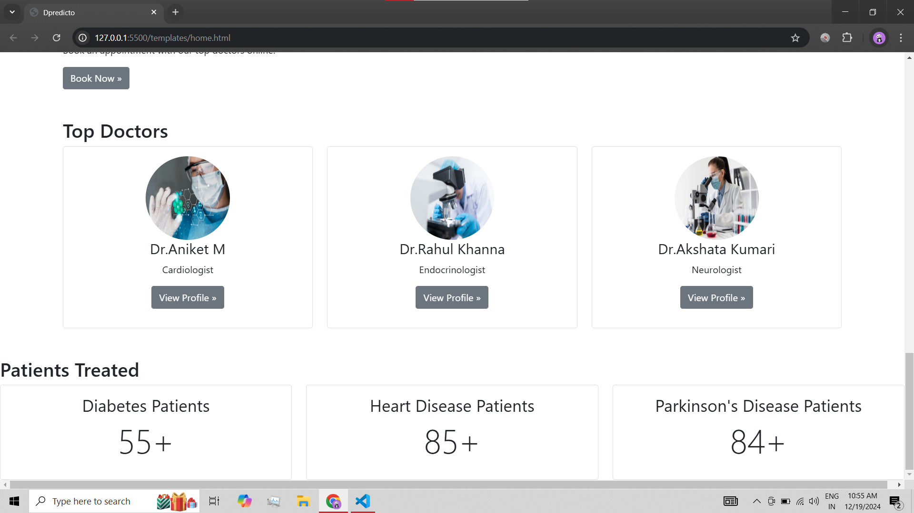
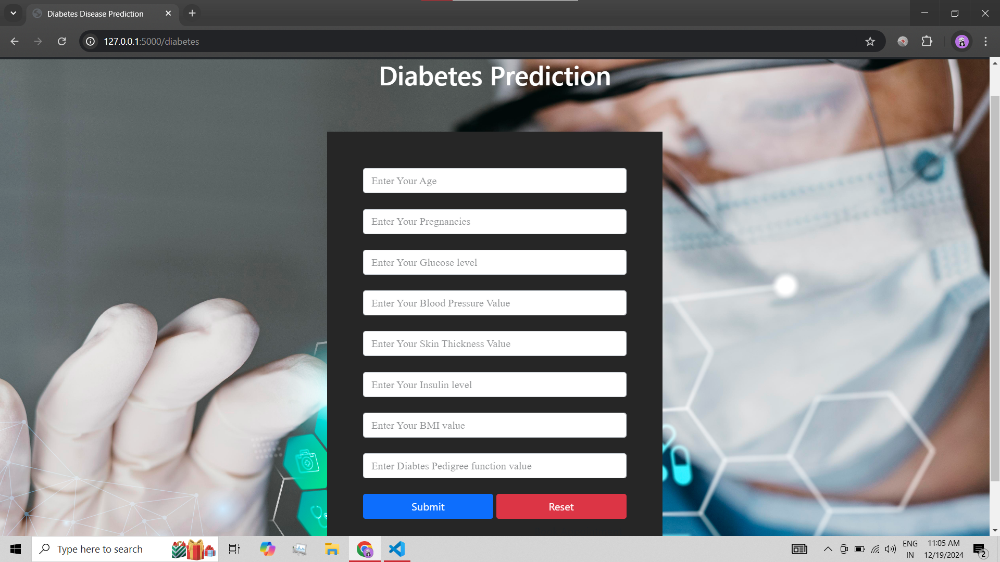
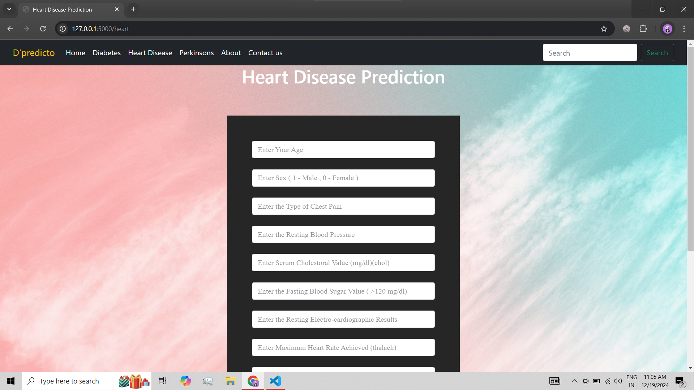
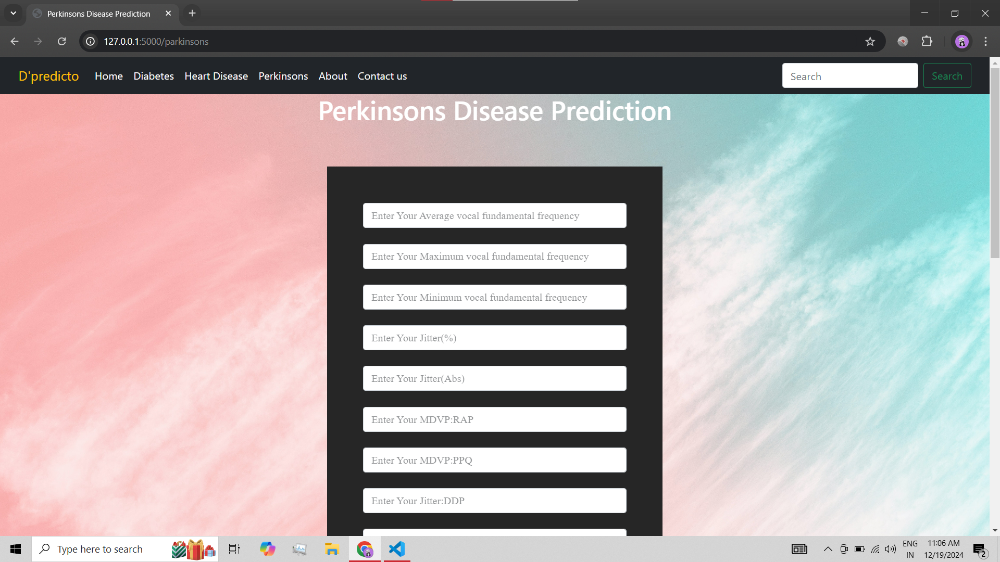
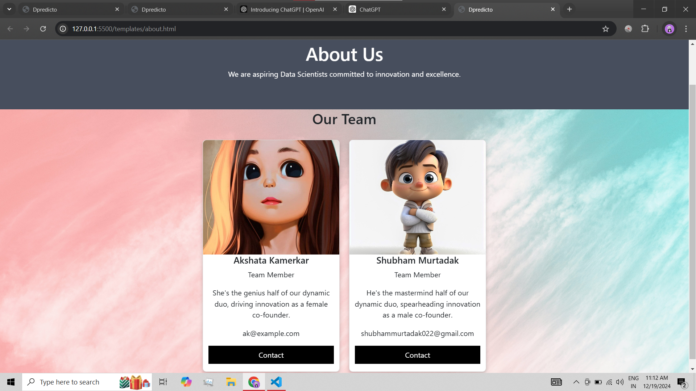
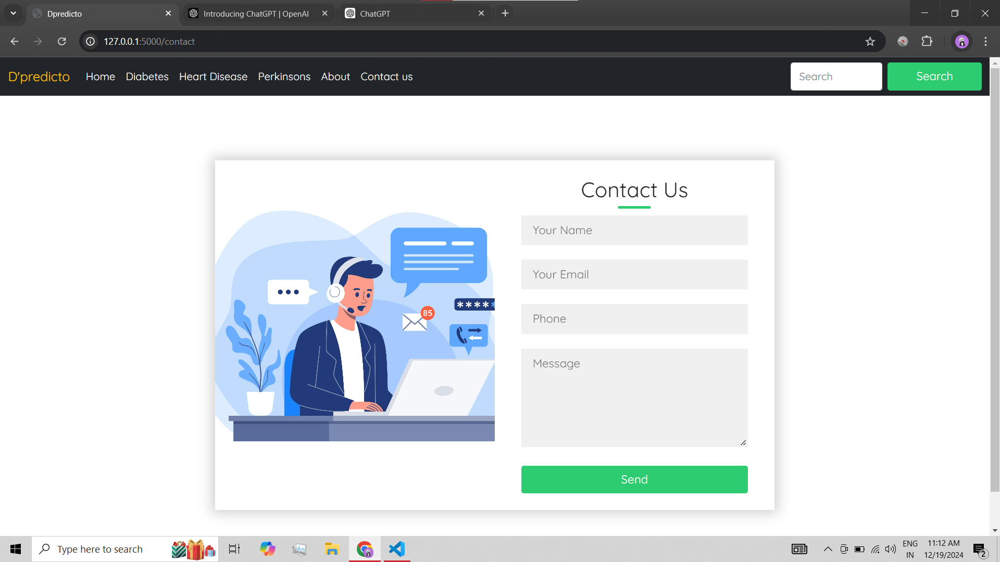

# 🎯 **D-predicto - Disease Prediction System** 🩺🧠  

D-predicto is an **end-to-end application** designed to assist users with disease prediction and provide a seamless healthcare experience. Predict diseases like:  
- **❤️ Heart Disease**  
- **🧠 Parkinson's Disease**  
- **🍬 Diabetes**  

Additionally, D-predicto features an **NLP-driven chatbot** 🤖, **doctor appointment booking** 📅, and **secure login authentication** 🔒.  

---

## 🌟 **Features**  

### 1️⃣ **Disease Prediction** 🔬  
Utilize advanced **XGBoost** and **Random Forest** models to predict:  
- **Diabetes**  
- **Heart Disease**  
- **Parkinson's Disease**  

### 2️⃣ **NLP-Powered Chatbot** 🤖  
A seamless chatbot experience that answers health-related queries and enhances user interaction.  

### 3️⃣ **Doctor Appointment Booking** 📅  
Schedule and manage appointments directly from the platform.  

### 4️⃣ **User Authentication** 🔒  
Secure login and user data handling with robust authentication mechanisms.  

---

## 🛠️ **Tech Stack**  

### Frontend 🌐  
- **HTML** 📄  
- **CSS** 🎨  
- **JavaScript** ⚡  

### Backend 🔗  
- **Flask** 🐍  
- **LangChain** 🧩  
- **Mixtral-8x7b (LLM)** 🧠  

### Machine Learning Models 🚀  
- **XGBoost** 🌟  
- **Random Forest** 🌲  

---

## 🖼️ **Screenshots**  

Below are glimpses of D-predicto's interface:  

| Screenshot | Description         |  
|------------|---------------------|  
|  | **Landing Page** 🌟 |  
|  | **services** 🔑 |  
|  | **Doctors intro** 🔬 |  
|  | **Dibeties prediction** 📊 |  
|  | **Heart Disease prediction** 📊 |  
|  | **Perkinsons prediction** 📅 |  
|  | **About US** 🧑‍⚕️ |  
|  | **Login** 🚪 |  

---

## 🤝 **Collaborators**  

- **Shubham Murtadak** ✨  
- **Akshata Kamerkar** 💡  

---

## 🎯 **Conclusion**  

D-predicto is a **comprehensive healthcare assistant** 🏥 that combines disease prediction, chatbot interaction, and appointment booking into one seamless platform. Its use of **XGBoost** and **Random Forest** models ensures **high accuracy**, making it an essential tool for users seeking reliable health insights.  

🔗 Stay tuned for more updates! 🚀  
